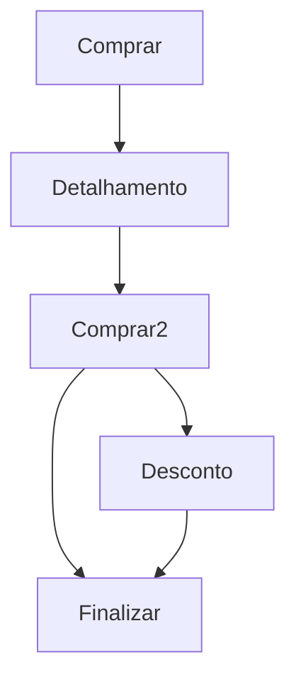
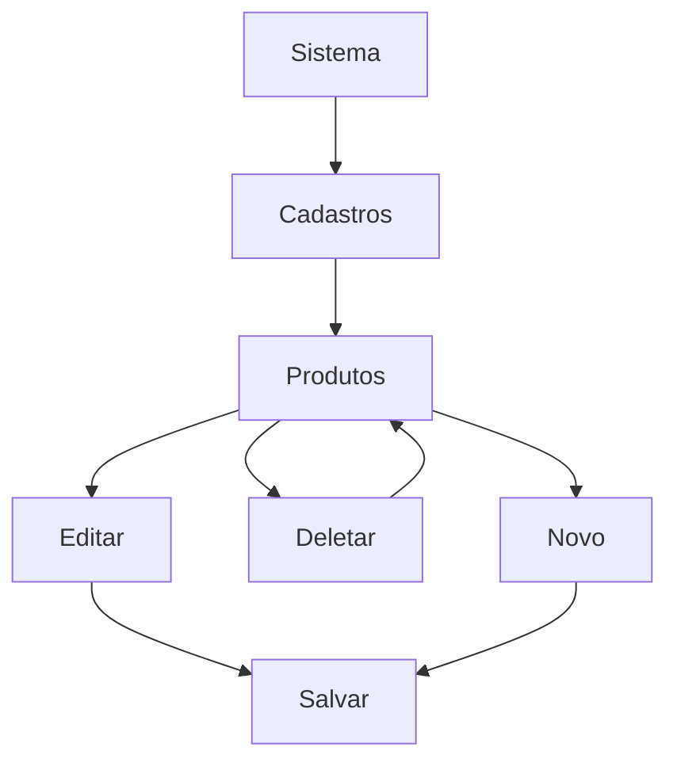
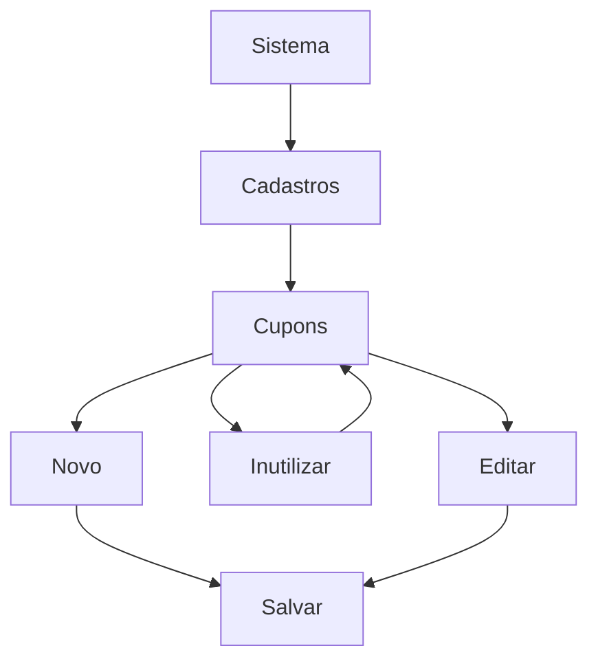
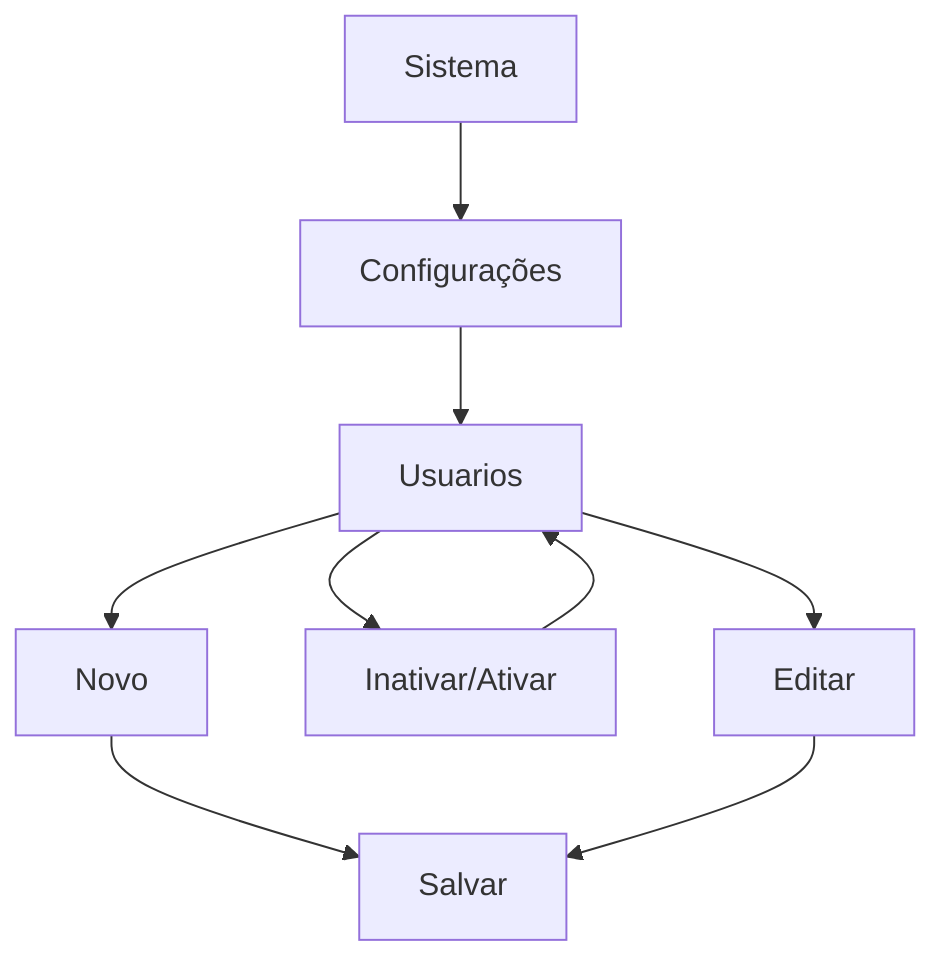
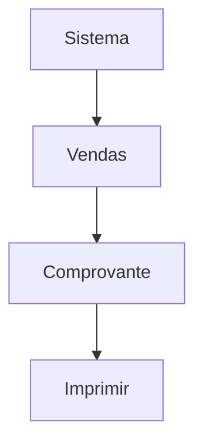
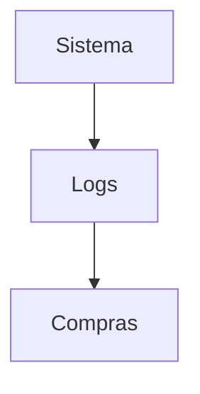
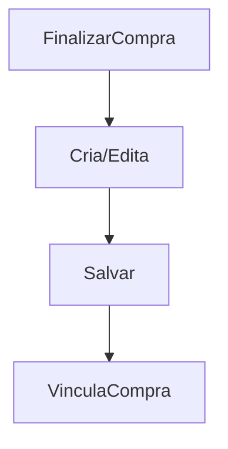

# 🚀 Projeto DevEvolution – SALES+/BUY+

Sistema de vendas de produtos desenvolvido durante a imersão **Dev{Evolution}**, promovida pela **IXC Soft S.A.**  
Este projeto foi construído com base na arquitetura **MVC**, implementando funcionalidades como cadastro de produtos, usuários, cupons, controle de estoque e geração de comprovantes em PDF.

---

## Descrição

O **SALES+/BUY+** é um sistema de gestão de vendas que permite:

- Gerenciar usuários, produtos e cupons.
- Realizar compras com reserva de estoque.
- Gerar comprovantes em PDF.
- Aplicar descontos promocionais via cupons.
- Visualizar logs e histórico de compras.

> Algumas funcionalidades podem estar incompletas, pois o sistema foi desenvolvido em apenas duas semanas.

---

## ⚙️ Pré-requisitos

- Composer 2.8 ou superior
- DomPDF 3.1 ou superior
- PHP 8.2 ou superior
- PHP-XML
- SQLite
- Git

---

## 📦 Instalação

### 1. Baixe o arquivo de nome install.sh do repositorio:

### 2. Acesse o usuário root do Debian/Ubuntu no terminal

> `su` Debian
> `sudo su` Ubuntu

### 3. Acesse a pasta que você baixou o arquivo install.sh (Normalmente na pasta Downloads)

> `cd /home/user/Downloads/`

### 4. Transforme o arquivo install.sh em um arquivo execultavel

> `chmod +x install.sh`

### 5. Por fim execulte o arquivo

> `./install.sh`

### 6. Agora é só acessar os links no navegador para explorar o sistema
Principais links:
- `http://localhost/sistema/public/` Login do painel
- `http://localhost/sistema/public/home.html` Painel de Administração
- `http://localhost/sistema/public/central.html` Local de compra pelo cliente
  
---

### O que foi implementado?

### Usuários

- [X]  Criar (cadastro via formulário HTML)
- [X]  Editar e deletar (somente próprios dados)
- [X]  Ver (lista restrita)

### Produtos / Ingressos

- [X]  Criar, editar, deletar, visualizar
- [X]  Reserva de estoque em tempo real (com `data_reserva`)
- [X]  Bloqueio por 2 minutos ao acessar o último item

### Clientes

- [X]  Criar, editar, deletar (restrito por usuário) OBS: Neste sistema não editamos o cliente diretamente, mas há um processamento interno para registrar os dados.
- [X]  Visualização restrita por usuário (não veem outros clientes)

### Compras

- [X]  Comprar produto, com controle de estoque
- [X]  Cancelar reserva após timeout (2 minutos)
- [X]  Exibir mensagem de "Produto indisponível" se esgotado

---

### Bonus

**Histórico de compras** 
- [X]   Inserir um sistema de logs de compras de ingressos/produtos.
- [X]   Permitir que o usuário veja todas as compras feitas
**Geração de comprovante em PDF** 
- [X]   Usado `dompdf/dompdf`
**Códigos de desconto / cupom** 
- [X]   Campo promocional que reduz o preço
      
---

Diagrama de funcionamento da compra:

Diagrama de funcionamento do produto:

Diagrama de funcionamento do cupom:

Diagrama de funcionamento de usuarios:

Diagrama de funcionamento da compra:

Diagrama de funcionamento dos logs_compra:

Diagrama de funcionamento dos clientes (interno):

