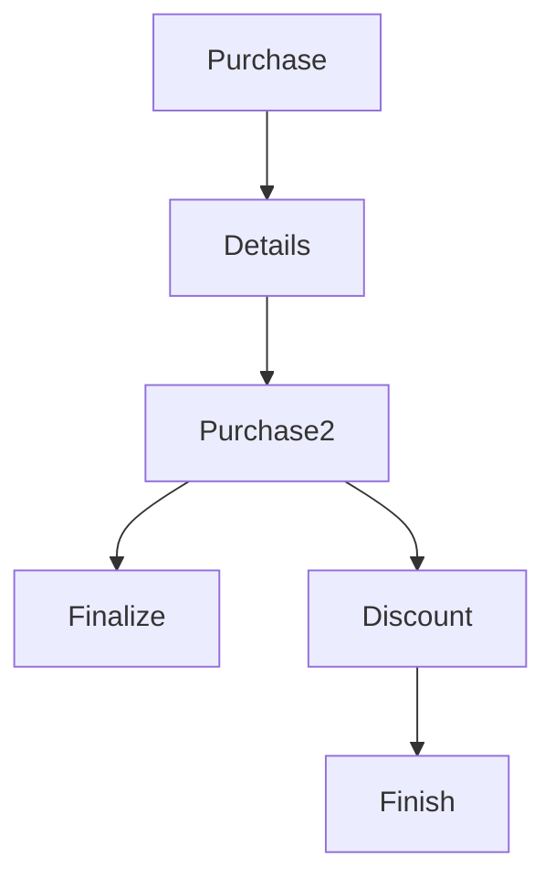
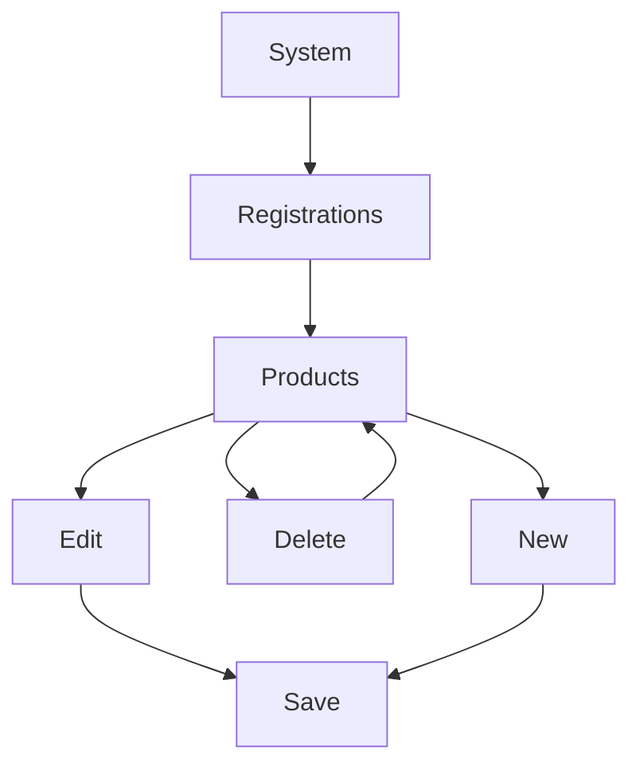
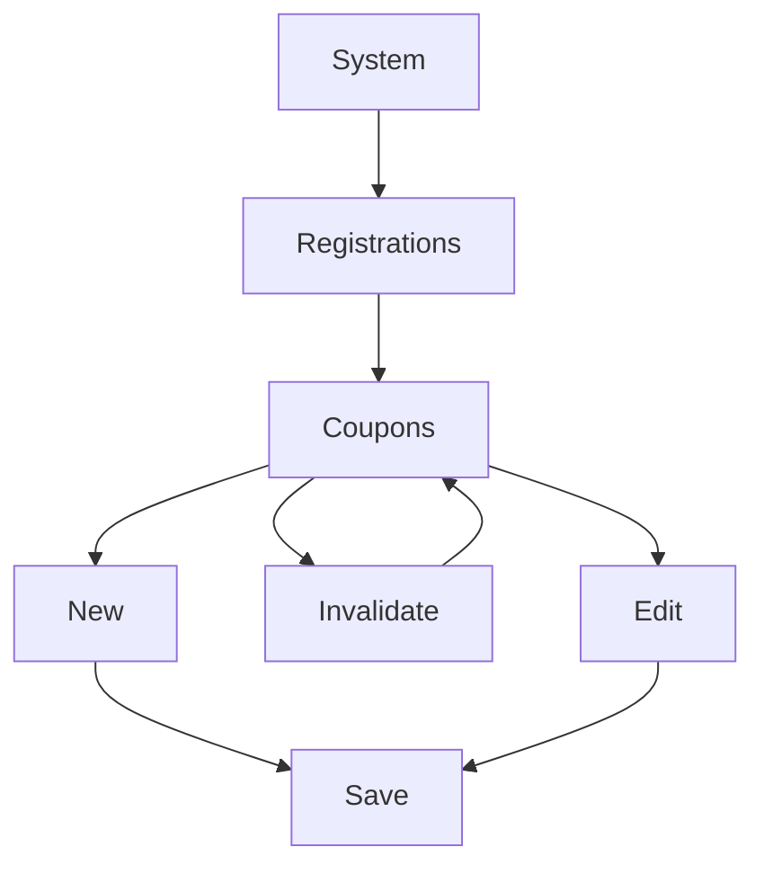
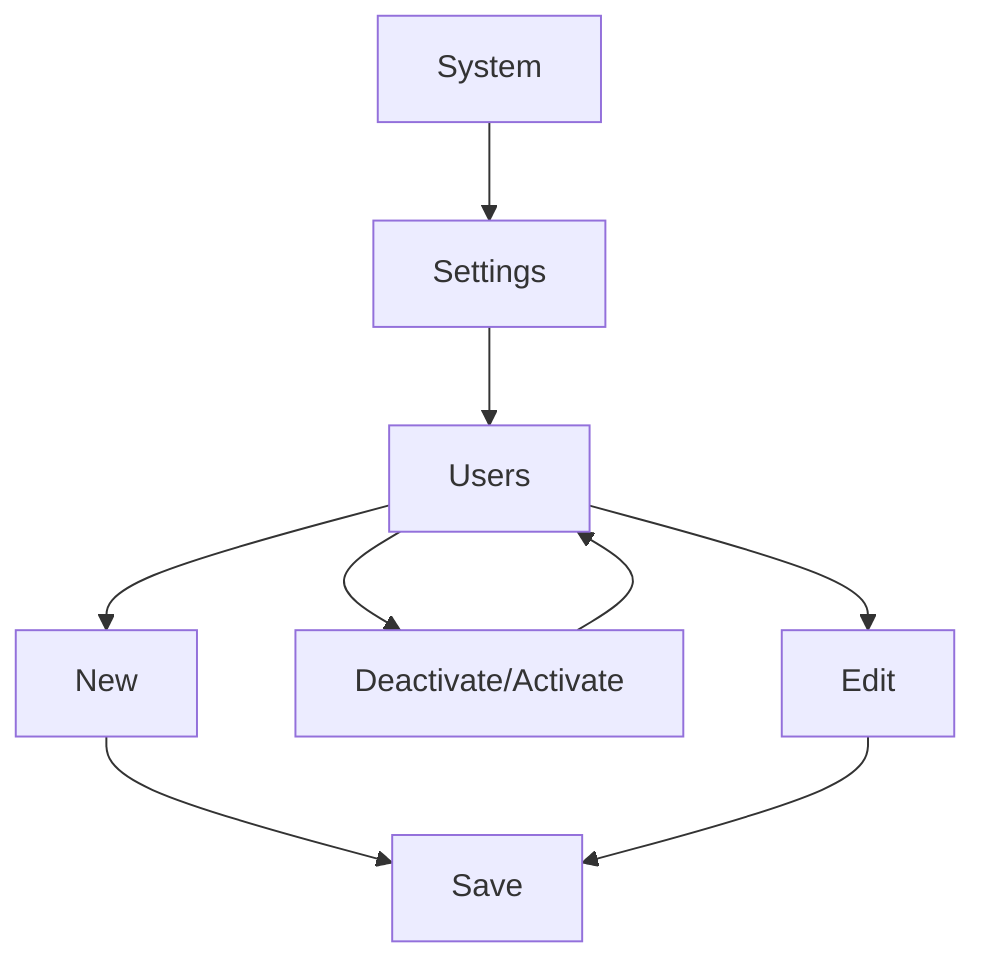
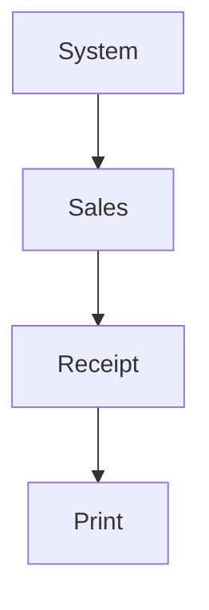
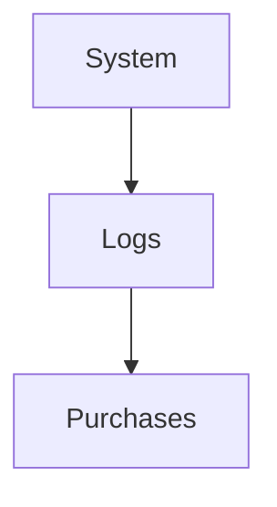
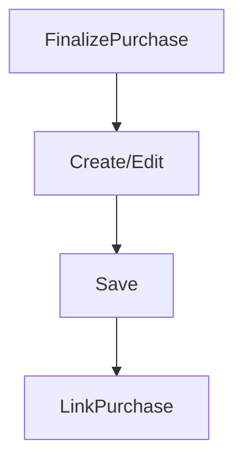

# 🚀 DevEvolution Project – SALES+/BUY+

Product sales system developed during the **Dev{Evolution}** immersion program, promoted by **IXC Soft S.A.**

This project was built based on the **MVC** architecture, implementing functionalities such as product registration, user management, coupon management, inventory control, and PDF receipt generation.

---

## Description

The **SALES+/BUY+** is a sales management system that allows you to:

- Manage users, products, and coupons.

- Make purchases with stock reservation.

- Generate PDF receipts.

- Apply promotional discounts via coupons.

- View purchase logs and history.

> Some functionalities may be incomplete, as the system was developed in only two weeks.

---

## ⚙️ Prerequisites

- Composer 2.8 or higher
- DomPDF 3.1 or higher
- PHP 8.2 or higher
- PHP-XML
- SQLite
- Git

---

## 📦 Installation

### 1. Download the file named install.sh from the repository:

### 2. Access the root user of Debian/Ubuntu in the terminal

> `su` Debian
> `sudo su` Ubuntu

### 3. Access the folder where you downloaded the install.sh file (Usually in the Downloads folder)

> `cd /home/user/Downloads/`

### 4. Make the install.sh file executable

> `chmod +x install.sh`

### 5. Finally, execute the file

> `./install.sh`

### 6. Now just access the links in your browser to explore the system.
Main links:
- `http://localhost/sistema/public/` Panel login
- `http://localhost/sistema/public/home.html` Administration panel
- `http://localhost/sistema/public/central.html` Customer purchase location

---

## After installation, the following credentials can be used to log into the system for testing.

Email: adm@adm.com
Password: teste

---

### What was implemented?

### Users

- [X] Create (registration via HTML form)
- [X] Edit and delete (own data only)
- [X] View (restricted list)

### Products / Tickets

- [X] Create, edit, delete, view
- [X] Real-time stock reservation (with `reservation_date`)
- [X] 2-minute lockout when accessing the last item

### Clients

- [X] Create, edit, delete (restricted per user) NOTE: In this system, we do not edit the client directly, but there is an internal processing to register the data.

- [X] Restricted user view (other customers cannot see)

### Purchases

- [X] Purchase product, with stock control
- [X] Cancel reservation after timeout (2 minutes)
- [X] Display "Product unavailable" message if sold out

---

### Bonus

**Purchase History**

- [X] Insert a system for logging ticket/product purchases.

- [X] Allow the user to view all purchases made

**PDF Receipt Generation**

- [X] Used `dompdf/dompdf`

**Discount Codes / Coupons**

- [X] Promotional field that reduces the price

---

Purchase Operation Diagram:

```mermaid
graph TD;

Purchase --> Details;
Details --> Purchase2;
Purchase2 --> Finalize;
Purchase2 --> Discount;
Discount --> Finish;

```

Product Functioning Diagram:

```mermaid
graph TD;
System --> Registrations;
Registrations --> Products;
Products --> New;
Products --> Delete;
Products --> Edit;
Delete --> Products;
Edit --> Save;
New --> Save;

```

Coupon Functioning Diagram:

```mermaid
graph TD;
System --> Registrations;
Registrations --> Coupons;
Coupons --> New;
New --> Save;
Coupons --> Invalidate;
Coupons --> Edit;
Invalidate --> Coupons;
Edit --> Save;

```

User Functioning Diagram:

```mermaid
graph TD;
System --> Settings;
Settings --> Users;
Users --> New;
Users --> Deactivate/Activate;
Deactivate/Activate --> Users;
Users --> Edit;
New --> Save;
Edit --> Save;

```

Purchase operation diagram:

```mermaid
graph TD;
System --> Sales;
Sales --> Receipt;
Receipt --> Print;
```

Purchase logs operation diagram:

```mermaid
graph TD;
System --> Logs;
Logs --> Purchases;

```

Customer operation diagram (internal):

```mermaid
graph TD;
FinalizePurchase --> Create/Edit;
Create/Edit --> Save;
Save --> LinkPurchase;
```
